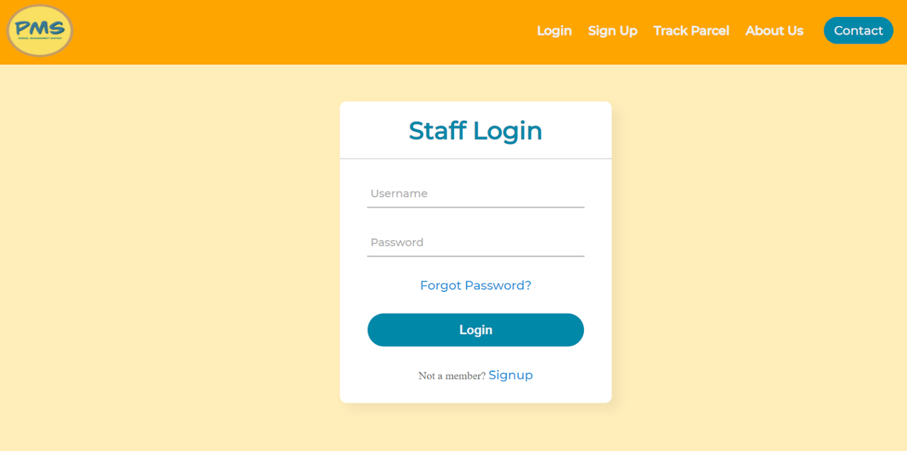
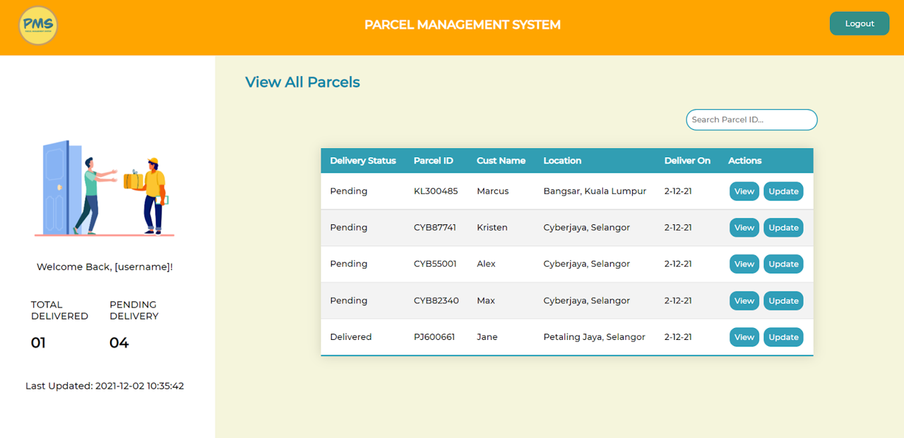
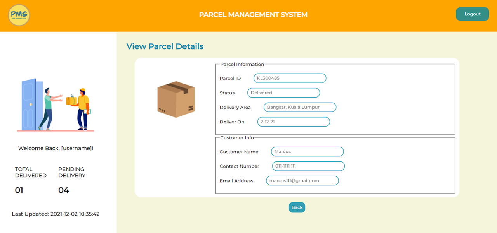
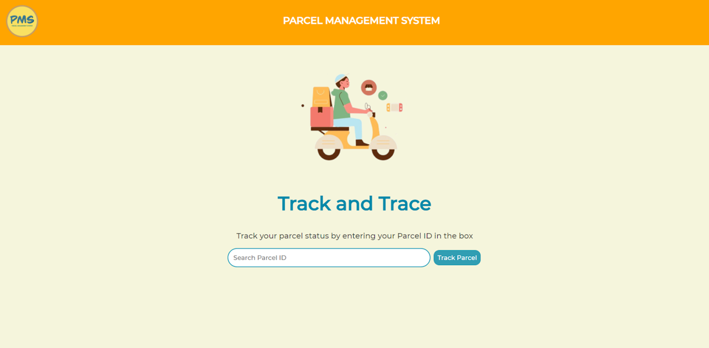

# Parcel Management System (PMS)
This is a group project done for our TSE2101 - Software Engineering Fundamentals course with the help from my teammates, Shawn and Davinia.

## Overview
This course challenges us to design a proposed system for a small company’s staff who is stationed at front desk to manage incoming parcels from customers and parcel pick-ups by several registered delivery service providers.
Parcel Management System (PMS) is our approach towards delivering this service to three user roles (Staff/Courier/Customer), namely with functions including:-

  * Register/Login
  * Send parcel
  * Pick-up parcel
  * Manage parcel/customer/delivery service provider
  * Generate report

## Screenshots
1. Home Page

2. Register/Login Page

3. Menu Page

4. Manage User

5. Manage Payment

7. Manage Parcel - Staff Role

- Courier Role

- Customer Role

7. Generate Report

